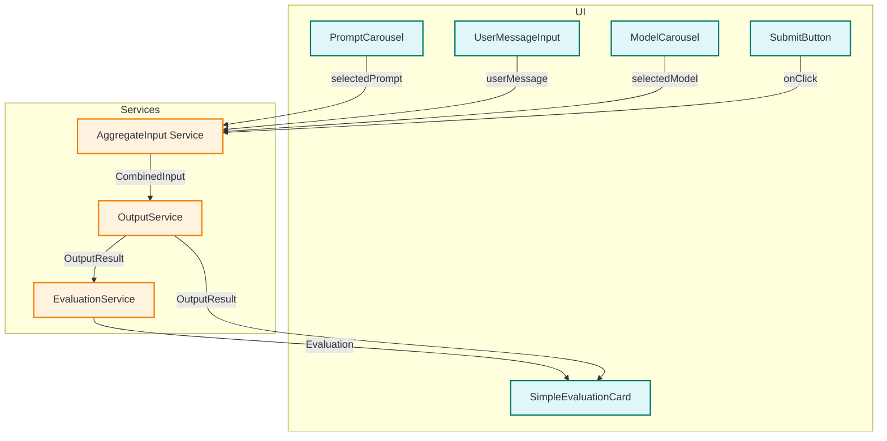

# Wizard Page Modular Architecture

## 1. Overview

This architecture modularizes the wizard-page update for extensibility, testability, and clear boundaries. All data flows and interfaces are explicit; no secrets or hard-coded env vars.

---

## 2. C4-Style Component Diagram (Mermaid)

**Legend:**  
- Blue: UI Components  
- Orange: Service/Logic Modules  
- Arrows: Data flow direction

---

## 3. Component & Service Boundaries

### UI Components
- **PromptCarousel**: Selects system message/prompt.  
  _Interface_: `onPromptSelect(prompt: Prompt): void`
- **UserMessageInput**: Collects user message.  
  _Interface_: `onSubmit(userMessage: string): void`
- **ModelCarousel**: Selects model.  
  _Interface_: `onModelSelect(model: Model): void`
- **SubmitButton**: Triggers aggregation and output generation.
- **SimpleEvaluationCard**: Displays output and evaluation.  
  _Props_: `{ outputResult: OutputResult, evaluation: Evaluation }`

### Services
- **AggregateInput Service**:  
  _Input_: userMessage, systemMessage, model  
  _Output_: CombinedInput  
  _Interface_: `aggregateInput(userMessage, systemMessage, model): CombinedInput`
- **OutputService**:  
  _Input_: CombinedInput  
  _Output_: OutputResult  
  _Interface_: `generateOutput(combinedInput, mode): Promise<OutputResult>`
- **EvaluationService**:  
  _Input_: OutputResult  
  _Output_: Evaluation  
  _Interface_: `evaluateOutput(outputResult): Promise<Evaluation>`

---

## 4. Data Flow

1. User selects a prompt (system message) and model, and enters a user message.
2. On submit, AggregateInput Service validates and combines inputs.
3. OutputService generates output (mock or real).
4. EvaluationService evaluates the output.
5. SimpleEvaluationCard displays the result and evaluation.

---

## 5. Extensibility & Testability

- All services are pure functions or async modules, easily mockable in tests.
- UI components are stateless or use local state, receiving data via props/callbacks.
- No direct store/context coupling in UI; all data flows via explicit interfaces.
- Adding new models, prompt types, or evaluation logic requires only extending service logic, not UI contracts.

---

## 6. Security & Performance

- No secrets or env vars in UI or service code.
- Async operations expose loading/error states via props.
- All error and edge cases surfaced to UI for user feedback.

---

## 7. Rationale

- Clear separation of UI and business logic enables independent testing and future extension.
- Explicit data contracts and prop-driven flow prevent hidden dependencies.
- Modular services allow swapping implementations (mock/real) for dev/test.